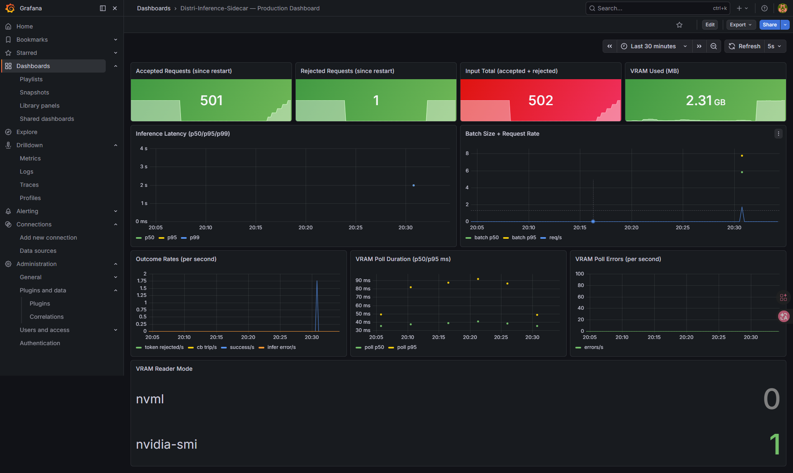

# Distri-Inference-Sidecar

[简体中文文档](README.zh-CN.md)

A lightweight production-style **gRPC inference sidecar** that provides:

- dynamic micro-batching for throughput
- token-limit guard backed by a Rust tokenizer
- VRAM-aware circuit breaker
- Prometheus/Grafana observability
- **NVML-first** GPU polling with `nvidia-smi` fallback

---

## Features

- **Dynamic batching** (`internal/batcher`)
  - queues single requests and flushes micro-batches to backend
  - adaptive wait window based on observed QPS
- **Token limit guard** (`internal/tokenizer`, `rust_ops`)
  - rejects oversized prompts before expensive backend calls
- **VRAM guard** (`internal/vramguard`)
  - opens circuit when VRAM utilization crosses threshold
  - supports `VRAM_READER_MODE=auto|nvml|smi`
- **Observability** (`internal/metrics`)
  - request/batch/success/error metrics
  - VRAM reader mode and polling quality metrics

---

## Architecture

```text
gRPC client (:50051)
    -> grpcserver.Infer()
       -> tokenizer.Validate()
       -> batcher.Submit()
          -> flushBatch() -> HTTP /infer (python_backend:8000)

vramguard.Start()
    -> reader: NVML (preferred) or nvidia-smi fallback
    -> circuit open/close state

metrics exposed at :9090/metrics
```

Authoritative token-limit enforcement is performed at sidecar ingress (`grpcserver` + `internal/tokenizer`). The Python backend is execution-only and does not perform token admission checks.

---

## Responsibility Boundary

- **Admission control (authoritative):** sidecar ingress (`grpcserver.Infer -> tokenizer.Validate`)
- **Circuit protection:** sidecar VRAM guard (`internal/vramguard`)
- **Execution only:** backend `/infer` forwards requests to model runtime and returns results
- **Benchmark only:** `python_backend/benchmark/tokenizer_bench.py` evaluates ctypes/FFI boundary overhead; it is not a production policy path

---

## Prerequisites

- Go 1.25+
- Rust 1.85+
- Python 3.12+ with `uv`
- NVIDIA driver + NVML available
- Docker + Docker Compose (recommended)

---

## Quick Start

### Docker Compose (recommended)

```bash
docker compose -p distribute up -d --build
```

Services:

- backend: `:8000`
- sidecar gRPC: `:50051`
- sidecar metrics: `:9091` (container `:9090`)
- prometheus: `:9090`
- grafana: `:3000`

### Local run (manual)

```bash
# terminal 1: backend
cd python_backend
uv sync
uv run uvicorn main:app --host 0.0.0.0 --port 8000

# optional: verify backend is in pure-execution mode
curl -s http://localhost:8000/health

# terminal 2: sidecar
cd ..
go build ./cmd/sidecar
BACKEND_URL=http://localhost:8000/infer ./sidecar
```

---

## Configuration

Environment variables:

| Key | Default | Description |
|---|---|---|
| `BACKEND_URL` | required | backend `/infer` endpoint |
| `VRAM_READER_MODE` | `auto` | **NVML-first** in `auto`; falls back to `nvidia-smi` only when NVML is unavailable. Can force `nvml` or `smi` |

Current sidecar runtime defaults (wired in `cmd/sidecar/main.go`):

- `PollIntervalMs = 500`
- `OOMThresholdPct = 90`
- `MaxBatchSize = 8`
- `MaxWaitMs = 50`

---

## gRPC API

Defined in `proto/inference.proto`:

- `Infer(InferRequest) returns (InferResponse)`
- `HealthCheck(HealthRequest) returns (HealthResponse)`

---

## Metrics

Core metrics:

- `infer_latency_ms` (histogram)
- `batch_size` (histogram)
- `rejected_requests_total` (token-limit rejections at sidecar ingress)
- `circuit_breaker_trips_total` (VRAM guard rejections)
- `infer_success_total`
- `infer_errors_total`
- `vram_used_mb`
- `vram_poll_duration_ms`
- `vram_poll_errors_total`
- `vram_reader_mode{mode="nvml|nvidia-smi"}`

Dashboard topline convention:

- `Accepted = batch_size_sum`
- `Rejected = rejected_requests_total + circuit_breaker_trips_total`
- `Input Total = Accepted + Rejected`

---

## Tests and Results

### 1) End-to-end system test (gRPC sidecar path)

```bash
cd python_backend
uv run test.py --concurrent 100 --rounds 5 --expected-reader-mode nvml
```

### 2) NVML vs SMI A/B test (same load)

```bash
# NVML run
VRAM_READER_MODE=nvml docker compose -p distribute up -d --build --force-recreate
cd python_backend
uv run test.py --concurrent 100 --rounds 5 --expected-reader-mode nvml

# SMI run
VRAM_READER_MODE=smi docker compose -p distribute up -d --build --force-recreate
cd python_backend
uv run test.py --concurrent 100 --rounds 5 --expected-reader-mode nvidia-smi
```

Result screenshots are stored in `docs/`.

Screenshots:

- SMI mode: 
- NVML mode: 

Observed outcome:

- reader mode switches correctly (`nvml=1` vs `nvidia-smi=1`)
- VRAM poll p95 drops from tens of ms (SMI) to sub-ms (NVML)
- no obvious request-outcome regression under the same load

### 3) Python vs Rust tokenizer benchmark

```bash
cd python_backend/benchmark
uv run tokenizer_bench.py
```

Benchmark screenshot:


Notes:

- benchmark focuses on binding-boundary overhead (ctypes/FFI), not production policy admission
- whitespace counting is an apples-to-apples baseline (Python split vs Rust split), where FFI overhead is amortized and Rust FFI can show speedup
- BPE encode: the dominant bottleneck is algorithm complexity in the current BPE implementation, not the binding layer
- do not compare Rust BPE timing directly against Python whitespace timing; they are different workloads
- takeaway: FFI acceleration is most effective when compute dominates boundary overhead; for high-frequency short calls, batch APIs are needed to amortize crossing cost
- output explicitly marks whether batch path is true FFI (`[ffi batch]`) or fallback

---

## Project Structure

```text
cmd/sidecar/            # entrypoint
internal/batcher/       # dynamic micro-batching
internal/grpcserver/    # gRPC API implementation
internal/metrics/       # Prometheus metrics
internal/tokenizer/     # Go <-> Rust tokenizer bridge
internal/vramguard/     # NVML/smi VRAM circuit breaker
python_backend/         # FastAPI backend and tests
rust_ops/               # Rust tokenizer + C ABI
docs/                   # result screenshots
```

---

## Development

```bash
# regenerate protobuf stubs
buf generate

# go sanity
go test ./...

# python lint
cd python_backend
uv run ruff check .
```

---

## License

This project is for educational and experimental use.
