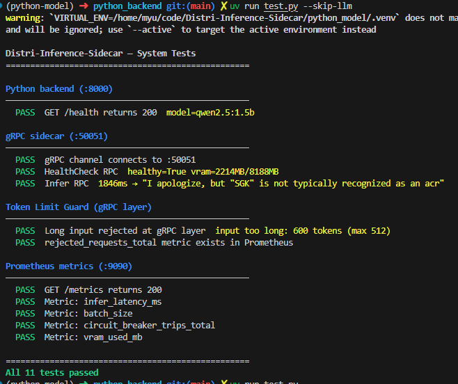
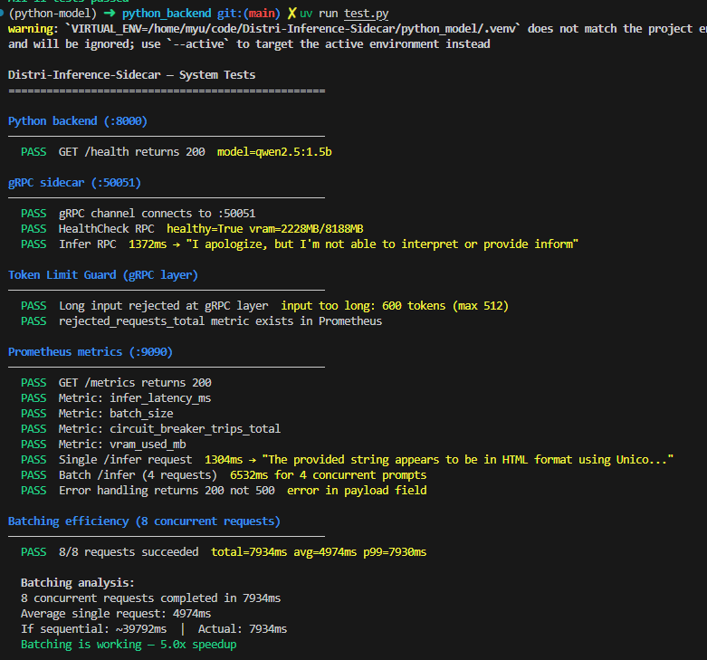
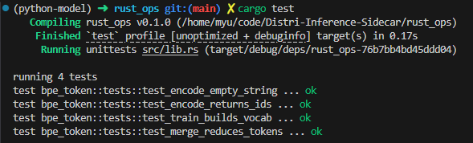
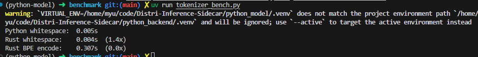
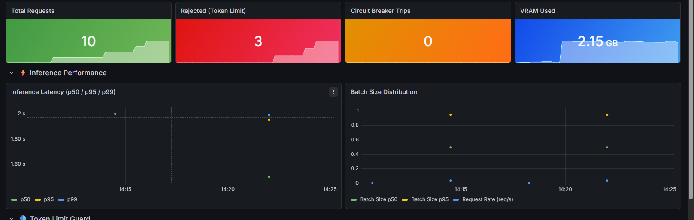
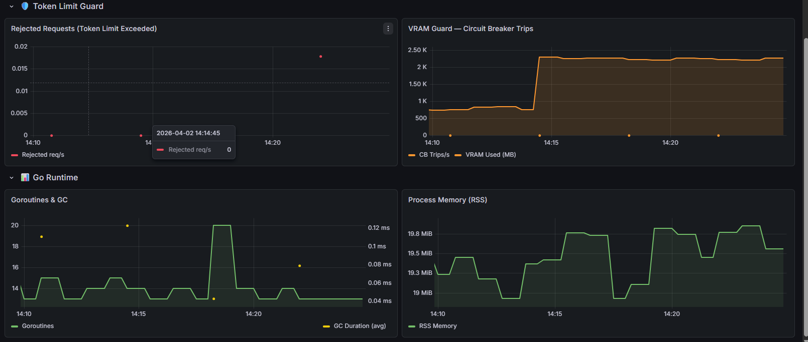

# Distri-Inference-Sidecar

A lightweight **gRPC sidecar** that sits next to an AI inference backend and provides:

- **Dynamic request batching** – collects individual gRPC requests into micro-batches before forwarding them to the backend, trading a small amount of latency for significantly higher throughput. The batch wait window shrinks automatically at low QPS and grows at high QPS.
- **VRAM circuit-breaker** – polls GPU memory via `nvidia-smi` and rejects new requests while utilisation is above a configurable threshold, preventing out-of-memory crashes.
- **Prometheus metrics** – exposes inference latency, batch-size distribution, circuit-breaker trip counts, and live VRAM usage on `:9090/metrics`.
- **Rust tokenizer library** – a C-ABI static library (`rust_ops`) providing whitespace-based token counting, linked into the Go sidecar via CGo for debug logging of prompt lengths.

---

## Architecture

```
gRPC client
     │  :50051
     ▼
┌─────────────────────────────────┐
│          gRPC Server            │  internal/grpcserver
│  Infer()  │  HealthCheck()      │
└────────────────┬────────────────┘
                 │ Submit()
                 ▼
┌─────────────────────────────────┐
│            Batcher              │  internal/batcher
│  queue → collectBatch()         │
│          flushBatch()  ─────────┼──► POST /infer  (Python backend :8000)
└────────────────┬────────────────┘
                 │ IsOpen()
                 ▼
┌─────────────────────────────────┐
│          VRAM Guard             │  internal/vramguard
│  polls nvidia-smi every 500 ms  │
│  circuit open when VRAM ≥ 90 %  │
└─────────────────────────────────┘

Prometheus metrics exposed on :9090/metrics  (internal/metrics)
```

---

## Prerequisites

| Tool | Purpose |
|------|---------|
| Go ≥ 1.21 | Build the sidecar |
| `nvidia-smi` | GPU VRAM polling (NVIDIA drivers required) |
| Python ≥ 3.12 + [uv](https://github.com/astral-sh/uv) | Run the mock backend |
| Rust ≥ 1.85 (edition 2024) | Build `rust_ops` static library |
| `protoc` + `buf` | Regenerate protobuf stubs (development only) |
| Docker + Docker Compose | Run the full stack (optional) |

---

## Quick Start

### 1. Build and run the sidecar

```bash
go build ./cmd/sidecar
./sidecar
```

### 2. Start the Python mock backend

The backend forwards prompts to an Ollama instance (model `qwen2.5:1.5b` by default) and must be able to reach it at `http://host.docker.internal:11434`.

```bash
cd python_backend
uv sync
uv run uvicorn main:app --host 0.0.0.0 --port 8000
```

### 3. (Optional) Build the Rust static library

```bash
cd rust_ops
cargo build --release
```

The compiled library (`librust_ops.a`) can then be linked into Go or C code via CGo.

### 4. Run the full stack with Docker Compose

Starts the Python backend, Go sidecar, Prometheus, and Grafana.

```bash
docker-compose up --build
```

| Service | Port | Description |
|---------|------|-------------|
| backend | `8000` | Python FastAPI → Ollama proxy |
| sidecar | `50051` / `9090` | gRPC server / Prometheus metrics |
| prometheus | `9091` | Prometheus UI |
| grafana | `3000` | Grafana dashboard |

---

## Configuration

The sidecar is configured directly in `cmd/sidecar/main.go`. Key parameters:

| Parameter | Default | Description |
|-----------|---------|-------------|
| `MaxBatchSize` | `8` | Maximum number of requests per batch flush |
| `MaxWaitMs` | `50` | Maximum time (ms) to wait before flushing an incomplete batch (scales down automatically at low QPS) |
| `BackendURL` | `$BACKEND_URL` | HTTP endpoint of the inference backend |
| `PollIntervalMs` | `500` | How often (ms) to query `nvidia-smi` for VRAM usage |
| `OOMThresholdPct` | `90.0` | VRAM utilisation (%) at which the circuit-breaker opens |
| gRPC address | `:50051` | Listening address of the gRPC server |
| Metrics address | `:9090` | Listening address of the Prometheus metrics endpoint |

---

## gRPC API

The service contract is defined in [`proto/inference.proto`](proto/inference.proto).

### `Infer`

Send a single inference request. The sidecar batches it transparently before forwarding to the backend.

```proto
rpc Infer(InferRequest) returns (InferResponse);
```

**Request**

| Field | Type | Description |
|-------|------|-------------|
| `request_id` | `string` | Unique identifier for correlating the response |
| `input_data` | `bytes` | Serialised model input (format is model-specific) |
| `model_name` | `string` | Name of the model to run on the backend |

**Response**

| Field | Type | Description |
|-------|------|-------------|
| `request_id` | `string` | Echoed from the request |
| `output_data` | `bytes` | Serialised model output |
| `latency_ms` | `int64` | End-to-end backend latency in milliseconds |
| `error` | `string` | Non-empty if the request failed |

### `HealthCheck`

Returns current VRAM usage and circuit-breaker state.

```proto
rpc HealthCheck(HealthRequest) returns (HealthResponse);
```

**Response**

| Field | Type | Description |
|-------|------|-------------|
| `healthy` | `bool` | `true` when the circuit-breaker is closed (accepting requests) |
| `vram_used_mb` | `float` | GPU VRAM currently in use (MB) |
| `vram_total_mb` | `float` | Total GPU VRAM available (MB) |

---

## Prometheus Metrics

| Metric | Type | Description |
|--------|------|-------------|
| `infer_latency_ms` | Histogram | End-to-end backend latency per batch flush |
| `batch_size` | Histogram | Number of requests in each flushed batch |
| `circuit_breaker_trips_total` | Counter | Requests rejected because the VRAM circuit is open |
| `vram_used_mb` | Gauge | Current GPU VRAM usage in MB |

---

## Project Structure

```
.
├── cmd/sidecar/          # Main entry point
├── internal/
│   ├── batcher/          # Dynamic request batcher (QPS-adaptive wait window)
│   ├── grpcserver/       # gRPC server implementation
│   ├── metrics/          # Prometheus metrics setup
│   ├── tokenizer/        # CGo wrapper for the Rust token-counting library
│   └── vramguard/        # GPU VRAM circuit-breaker
├── proto/                # Protobuf service definition
├── gen/                  # Auto-generated Go protobuf stubs
├── python_backend/       # FastAPI backend that proxies requests to Ollama
├── rust_ops/             # Rust static library (C ABI) – tokenizer implementation
├── buf.yaml              # Buf configuration for protobuf linting
├── buf.gen.yaml          # Buf code-generation configuration
└── docker-compose.yaml   # Full-stack Docker Compose setup
```

---

## Development

### Regenerate protobuf stubs

```bash
buf generate
```

### Lint Go code

```bash
go vet ./...
```

### Lint Python code

```bash
cd python_backend
uv run ruff check .
```
---
## Test and Result

### System Tests (15/15 passed)




Key results:
- Token limit guard: 600-token input correctly rejected (max 512)
- Batching efficiency: **5.0x speedup** with 8 concurrent requests
- End-to-end Infer RPC: ~1300ms (Qwen2.5:1.5b on local GPU)

### Rust Unit Tests (4/4 passed) 



### Compare python, rust and bpe


### Grafana Dashboard




---

## License

This project is provided as-is for educational and experimental purposes.