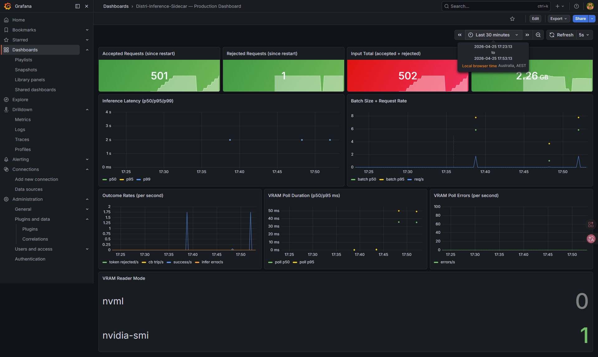
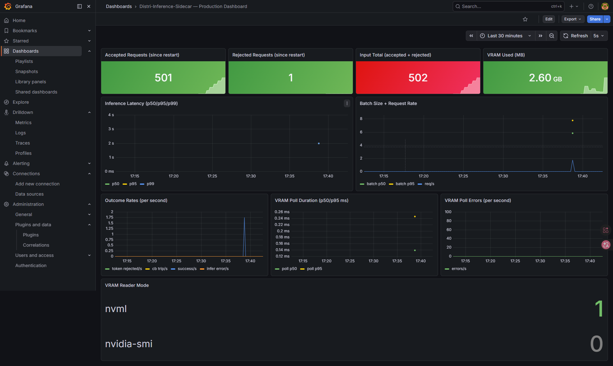
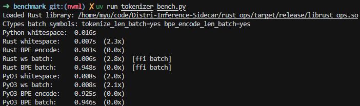

# Distri-Inference-Sidecar

[English README](README.md)

一个面向生产形态的 **gRPC 推理 Sidecar**，提供：

- 动态微批处理（提升吞吐）
- 基于 Rust tokenizer 的 token 长度保护
- 显存感知熔断（VRAM circuit breaker）
- Prometheus/Grafana 可观测性
- **NVML 优先** 的显存采样（不可用时回退 `nvidia-smi`）

---

## 核心能力

- **动态批处理**（`internal/batcher`）
  - 接收单请求，按窗口聚合后统一下发后端
  - 根据 QPS 动态调整等待窗口
- **Token 限制保护**（`internal/tokenizer`, `rust_ops`）
  - 在进入后端前拦截超长输入
- **显存熔断保护**（`internal/vramguard`）
  - 显存超阈值时拒绝新请求
  - 支持 `VRAM_READER_MODE=auto|nvml|smi`
- **可观测性**（`internal/metrics`）
  - 请求/批次/成功/失败指标
  - 显存采样模式与采样质量指标

---

## 架构

```text
gRPC client (:50051)
    -> grpcserver.Infer()
       -> tokenizer.Validate()
       -> batcher.Submit()
          -> flushBatch() -> HTTP /infer (python_backend:8000)

vramguard.Start()
    -> reader: NVML(优先) 或 nvidia-smi(回退)
    -> 熔断状态开/关

指标暴露: :9090/metrics
```

---

## 环境要求

- Go 1.25+
- Rust 1.85+
- Python 3.12+（使用 `uv`）
- NVIDIA 驱动 + NVML 可用
- Docker + Docker Compose（推荐）

---

## 快速启动

### Docker Compose（推荐）

```bash
docker compose -p distribute up -d --build
```

服务端口：

- backend: `:8000`
- sidecar gRPC: `:50051`
- sidecar metrics: `:9091`（容器内 `:9090`）
- prometheus: `:9090`
- grafana: `:3000`

### 本地手动启动

```bash
# 终端1：backend
cd python_backend
uv sync
uv run uvicorn main:app --host 0.0.0.0 --port 8000

# 终端2：sidecar
cd ..
go build ./cmd/sidecar
BACKEND_URL=http://localhost:8000/infer ./sidecar
```

---

## 配置项

| 配置 | 默认值 | 说明 |
|---|---|---|
| `BACKEND_URL` | 必填 | 后端 `/infer` 地址 |
| `VRAM_READER_MODE` | `auto` | 默认 `auto` 为 **NVML 优先**；仅在 NVML 不可用时回退 `nvidia-smi`。也可强制 `nvml` 或 `smi` |
| `PollIntervalMs` | `500` | 显存采样周期 |
| `OOMThresholdPct` | `90` | 熔断阈值 |
| `MaxBatchSize` | `8` | 单批最大请求数 |
| `MaxWaitMs` | `50` | 批处理最大等待时间 |

---

## gRPC API

定义见 `proto/inference.proto`：

- `Infer(InferRequest) returns (InferResponse)`
- `HealthCheck(HealthRequest) returns (HealthResponse)`

---

## 指标

核心指标：

- `infer_latency_ms`（直方图）
- `batch_size`（直方图）
- `rejected_requests_total`
- `circuit_breaker_trips_total`
- `infer_success_total`
- `infer_errors_total`
- `vram_used_mb`
- `vram_poll_duration_ms`
- `vram_poll_errors_total`
- `vram_reader_mode{mode="nvml|nvidia-smi"}`

---

## 测试与结果

### 1）端到端系统测试（走 gRPC sidecar）

```bash
cd python_backend
uv run test.py --concurrent 100 --rounds 5 --expected-reader-mode nvml
```

### 2）NVML vs SMI 对比实验（同负载）

```bash
# NVML
VRAM_READER_MODE=nvml docker compose -p distribute up -d --build --force-recreate
cd python_backend
uv run test.py --concurrent 100 --rounds 5 --expected-reader-mode nvml

# SMI
VRAM_READER_MODE=smi docker compose -p distribute up -d --build --force-recreate
cd python_backend
uv run test.py --concurrent 100 --rounds 5 --expected-reader-mode nvidia-smi
```

截图：

- SMI：
- NVML：

结论：

- reader mode 切换正确（`nvml=1` 或 `nvidia-smi=1`）
- 显存采样 p95 从几十毫秒（SMI）降到亚毫秒（NVML）
- 同负载下请求结果未见明显回归

### 3）Python vs Rust tokenizer 基准

```bash
cd python_backend/benchmark
uv run tokenizer_bench.py
```

截图：



说明：

- whitespace 路径 Rust/PyO3 明显快于 Python
- BPE 编码主要受算法本体影响
- 输出会标注 batch 是否为真实 FFI（`[ffi batch]`）还是回退路径

---

## 项目结构

```text
cmd/sidecar/            # 入口
internal/batcher/       # 动态批处理
internal/grpcserver/    # gRPC 服务实现
internal/metrics/       # Prometheus 指标
internal/tokenizer/     # Go <-> Rust tokenizer 桥接
internal/vramguard/     # NVML/smi 显存熔断
python_backend/         # FastAPI 后端与测试
rust_ops/               # Rust tokenizer + C ABI + PyO3
docs/                   # 实验截图
```

---

## 开发命令

```bash
# 重新生成 protobuf
buf generate

# Go 检查
go test ./...

# Python lint
cd python_backend
uv run ruff check .
```

---

## License

本项目用于学习与实验目的。
