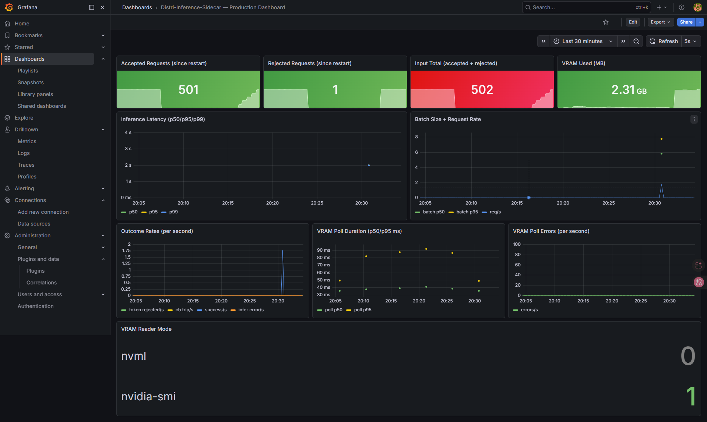
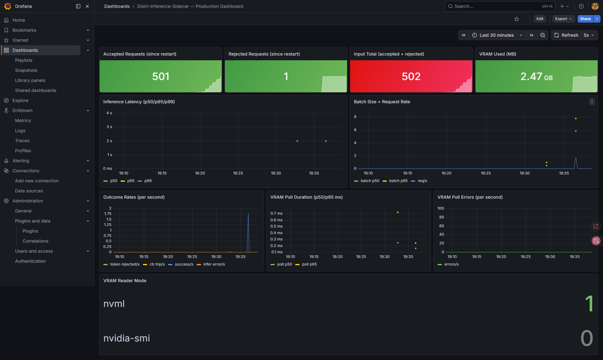
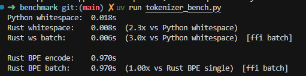

# Distri-Inference-Sidecar

[English README](README.md)

一个面向生产形态的 **gRPC 推理 Sidecar**，提供：

- 动态微批处理（提升吞吐）
- 基于 Rust tokenizer 的 token 长度保护
- 显存感知熔断（VRAM circuit breaker）
- Prometheus/Grafana 可观测性
- **NVML 优先** 的显存采样（不可用时回退 `nvidia-smi`）

---

## 核心能力

- **动态批处理**（`internal/batcher`）
  - 接收单请求，按窗口聚合后统一下发后端
  - 根据 QPS 动态调整等待窗口
- **Token 限制保护**（`internal/tokenizer`, `rust_ops`）
  - 在进入后端前拦截超长输入
- **显存熔断保护**（`internal/vramguard`）
  - 显存超阈值时拒绝新请求
  - 支持 `VRAM_READER_MODE=auto|nvml|smi`
- **可观测性**（`internal/metrics`）
  - 请求/批次/成功/失败指标
  - 显存采样模式与采样质量指标

---

## 架构

```text
gRPC client (:50051)
    -> grpcserver.Infer()
       -> tokenizer.Validate()
       -> batcher.Submit()
          -> flushBatch() -> HTTP /infer (python_backend:8000)

vramguard.Start()
    -> reader: NVML(优先) 或 nvidia-smi(回退)
    -> 熔断状态开/关

指标暴露: :9090/metrics
```

权威 token-limit 准入校验在 sidecar 入口执行（`grpcserver` + `internal/tokenizer`）。Python backend 为纯执行层，不做 token 准入校验。

---

## 职责边界

- **权威准入：** sidecar 入口（`grpcserver.Infer -> tokenizer.Validate`）
- **熔断保护：** sidecar VRAM guard（`internal/vramguard`）
- **纯执行层：** backend `/infer` 仅调用模型并返回结果
- **基准实验：** `python_backend/benchmark/tokenizer_bench.py` 仅评估 ctypes/FFI 边界开销，不参与线上策略

---

## 环境要求

- Go 1.25+
- Rust 1.85+
- Python 3.12+（使用 `uv`）
- NVIDIA 驱动 + NVML 可用
- Docker + Docker Compose（推荐）

---

## 快速启动

### Docker Compose（推荐）

```bash
docker compose -p distribute up -d --build
```

服务端口：

- backend: `:8000`
- sidecar gRPC: `:50051`
- sidecar metrics: `:9091`（容器内 `:9090`）
- prometheus: `:9090`
- grafana: `:3000`

### 本地手动启动

```bash
# 终端1：backend
cd python_backend
uv sync
uv run uvicorn main:app --host 0.0.0.0 --port 8000

# 可选：确认 backend 处于纯执行模式
curl -s http://localhost:8000/health

# 终端2：sidecar
cd ..
go build ./cmd/sidecar
BACKEND_URL=http://localhost:8000/infer ./sidecar
```

---

## 配置项

环境变量：

| 配置 | 默认值 | 说明 |
|---|---|---|
| `BACKEND_URL` | 必填 | 后端 `/infer` 地址 |
| `VRAM_READER_MODE` | `auto` | 默认 `auto` 为 **NVML 优先**；仅在 NVML 不可用时回退 `nvidia-smi`。也可强制 `nvml`、`smi` 或 `nvidia-smi`（`smi` 的别名） |
| `MAX_BATCH_SIZE` | `8` | 单批最大请求数，达到后立即 flush |
| `MAX_WAIT_MS` | `50` | 收集未满批次的最长等待时间（毫秒） |
| `BACKEND_TIMEOUT_MS` | `120000` | 单次后端 batch HTTP 调用超时（毫秒） |
| `BATCHER_DEBUG_TOKENIZE` | 关闭 | 可选调试开关；设为 `true` 时，在 batcher 内打印每条请求的 BPE token 数（生产环境不建议开启） |

当前 sidecar 运行默认值（写在 `cmd/sidecar/main.go`）：

- `PollIntervalMs = 500`
- `OOMThresholdPct = 90`
- `MaxBatchSize = 8`（可通过 `MAX_BATCH_SIZE` 覆盖）
- `MaxWaitMs = 50`（可通过 `MAX_WAIT_MS` 覆盖）

---

## gRPC API

定义见 `proto/inference.proto`：

- `Infer(InferRequest) returns (InferResponse)`
- `HealthCheck(HealthRequest) returns (HealthResponse)`

---

## 指标

核心指标：

- `infer_latency_ms`（直方图）
- `batch_size`（直方图）
- `rejected_requests_total`（sidecar 入口 token 限制拒绝）
- `circuit_breaker_trips_total`（VRAM 熔断拒绝）
- `infer_success_total`
- `infer_errors_total`
- `vram_used_mb`
- `vram_poll_duration_ms`
- `vram_poll_errors_total`
- `vram_reader_mode{mode="nvml|nvidia-smi"}`

Dashboard 顶部口径：

- `Accepted = batch_size_sum`
- `Rejected = rejected_requests_total + circuit_breaker_trips_total`
- `Input Total = Accepted + Rejected`

---

## 测试与结果

### 1）端到端系统测试（走 gRPC sidecar）

```bash
cd python_backend
uv run test.py --concurrent 100 --rounds 5 --expected-reader-mode nvml
```

### 2）NVML vs SMI 对比实验（同负载）

```bash
# NVML
VRAM_READER_MODE=nvml docker compose -p distribute up -d --build --force-recreate
cd python_backend
uv run test.py --concurrent 100 --rounds 5 --expected-reader-mode nvml

# SMI
VRAM_READER_MODE=smi docker compose -p distribute up -d --build --force-recreate
cd python_backend
uv run test.py --concurrent 100 --rounds 5 --expected-reader-mode nvidia-smi
```

结果截图统一存放在 `docs/` 目录。

截图：

- SMI：
- NVML：

实测数据（100 并发，5 轮，同负载）：

| 指标 | NVML 模式 | nvidia-smi 模式 |
|------|-----------|-----------------|
| 显存采样 p95 | < 1 ms（峰值 ~0.7 ms） | 30–90 ms |
| 接受请求数 | 501 | 501 |
| 拒绝请求数 | 1 | 1 |
| 显存占用 | ~2.47 GB | ~2.31 GB |

- reader mode 切换正确（`nvml=1` 或 `nvidia-smi=1`）
- NVML 模式将采样 p95 抖动压制 **> 97%**，同负载下请求结果无回归

### 3）批处理吞吐对比（有/无 batching）

使用 Docker Compose 与 `python_backend/benchmark/batching_bench.py` 复现：

```bash
# 无 batching
MAX_BATCH_SIZE=1 MAX_WAIT_MS=0 VRAM_READER_MODE=nvml \
  docker compose -p distribute up -d --build --force-recreate sidecar
cd python_backend
uv run benchmark/batching_bench.py --concurrent 100 --rounds 5 --json

# 有 batching（默认）
MAX_BATCH_SIZE=8 MAX_WAIT_MS=50 VRAM_READER_MODE=nvml \
  docker compose -p distribute up -d --build --force-recreate sidecar
uv run benchmark/batching_bench.py --concurrent 100 --rounds 5 --json
```

实测环境：`qwen2.5:1.5b` + Ollama，100 并发，5 轮，NVML 模式，`BACKEND_TIMEOUT_MS=120000`：

| 场景 | 并发 | MaxBatch | MaxWait | 平均延迟 | p95/TTFT | 吞吐 (req/s) |
|---|---:|---:|---:|---:|---:|---:|
| no batching | 100 | 1 | 0 ms | 47,811 ms | 60,513 ms | 1.65 |
| batching | 100 | 8 | 50 ms | 59,924 ms | 60,148 ms | 1.66 |

说明：

- 当前 workload 受 GPU 推理（Ollama 串行）主导，端到端吞吐接近；batching 主要减少 sidecar→backend HTTP 扇出（每轮约 500 次请求 → ~65 次 flush，平均 batch size ~7.6）
- batching 让尾延迟更稳定（p95 60.1 s vs 60.5 s），平均延迟会因等待窗口略升
- 在 30 s 后端超时、100 并发下，no batching 仅完成 20/100，batching 为 0/100；当前默认已为 120 s（`BACKEND_TIMEOUT_MS=120000`），仅在测试超时行为时才应调低

### 4）Python vs Rust tokenizer 基准

```bash
cd python_backend/benchmark
uv run tokenizer_bench.py
```

截图：



说明：

- benchmark 仅用于评估绑定层边界开销（ctypes/FFI），不是线上策略入口
- whitespace 场景是同口径对比（Python split vs Rust split）；在该口径下 FFI 边界开销可被摊薄，Rust FFI 可体现加速
- BPE encode 场景：当前瓶颈主要在算法复杂度，而非绑定层
- 不要把 Rust BPE 时间直接和 Python whitespace 时间做倍数对比，这不是同一工作负载
- 结论：当计算开销主导时 FFI 加速更有效；高频短调用需要批量接口来摊薄边界成本
- 输出会标注 batch 是否为真实 FFI（`[ffi batch]`）还是回退路径

---

## 项目结构

```text
cmd/sidecar/            # 入口
internal/batcher/       # 动态批处理
internal/grpcserver/    # gRPC 服务实现
internal/metrics/       # Prometheus 指标
internal/tokenizer/     # Go <-> Rust tokenizer 桥接
internal/vramguard/     # NVML/smi 显存熔断
python_backend/         # FastAPI 后端与测试
rust_ops/               # Rust tokenizer + C ABI
docs/                   # 实验截图
```

---

## 开发命令

```bash
# 重新生成 protobuf
buf generate

# Go 检查
go test ./...

# Python lint
cd python_backend
uv run ruff check .
```

---

## License

本项目用于学习与实验目的。
