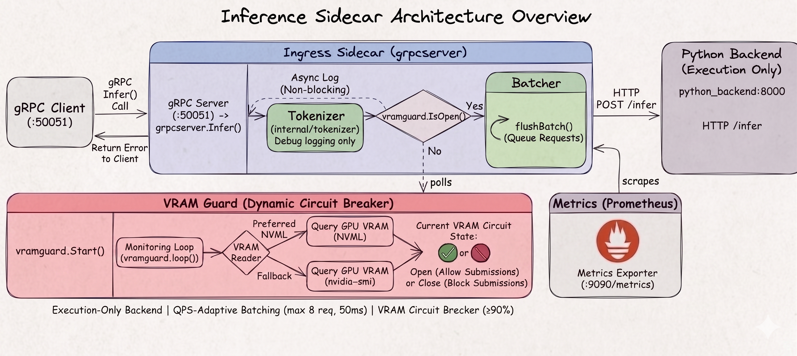

# Distri-Inference-Sidecar

[English README](README.md)

面向生产的 **gRPC 推理 Sidecar**：聚合并发请求、在入口做 token 准入、显存熔断保护，并导出 Prometheus 指标，无需改动现有模型运行时。

---

## 架构



```text
gRPC 客户端 (:50051)
  → tokenizer.Validate()     # 权威准入
  → batcher.Submit()         # 微批处理
  → HTTP POST /infer         # python_backend :8000 → Ollama

vramguard                    # NVML 优先显存采样 + 迟滞熔断
metrics                      # :9090/metrics（含 /health 探针）
```

Python backend 为**纯执行层**，不做 token 准入。API 与环境变量见 [configuration](docs/configuration.md)。

---

## 三个关键工程决策

1. **准入在 sidecar，不在 backend** — 经 `rust_ops` 的 BPE 计数在批处理与后端调用之前执行；拒绝返回 gRPC `InvalidArgument`，模型执行错误留在 `InferResponse.error`。

2. **微批处理减少 HTTP 扇出，而非提升 GPU 并行** — 按数量与短等待窗口聚合。Ollama 串行推理下成功吞吐仍受 GPU 限制；主要收益是 sidecar→backend 调用次数下降（**501 → 66** 次 flush，平均批大小 **7.6**，约 **87%** 减少）。详见 [benchmarks](docs/benchmarks.md)。

3. **NVML 优先 + 迟滞熔断** — NVML 采样 p95 < 1 ms，不可用时回退 `nvidia-smi`；90% 开熔断、85% 关熔断，避免抖动。过载映射为 gRPC `ResourceExhausted`。

---

## 快速启动

**Docker Compose（推荐）**

```bash
docker compose -p distribute up -d --build
```

| 服务 | 端口 |
|------|------|
| backend | `:8000` |
| sidecar gRPC | `:50051` |
| sidecar metrics | `:9091`（容器内 `:9090`） |
| Prometheus | `:9090` |
| Grafana | `:3000`（Dashboard：**Distri-Inference-Sidecar**） |

**本地手动（两个终端）**

```bash
# backend
cd python_backend && uv sync && uv run uvicorn main:app --host 0.0.0.0 --port 8000

# sidecar（仓库根目录；须先构建 rust_ops，见 limitations）
cd rust_ops && cargo build --release && cd ..
LD_LIBRARY_PATH=$PWD/rust_ops/target/release \
  BACKEND_URL=http://localhost:8000/infer go run ./cmd/sidecar
```

环境：Go 1.25+、Rust 1.85+、Python 3.12+（`uv`）、NVIDIA 驱动（生产路径 VRAM guard）。

---

## 关键实验结论

| 实验 | 结论摘要 |
|------|----------|
| [NVML vs SMI](docs/benchmarks.md#nvml-vs-smi-vram-polling-100-concurrent-5-rounds) | NVML 采样 **亚毫秒** vs SMI **~30–55 ms**（降低 **> 97%**）；100 并发下两者都会撞上 120 s 超时预算 |
| [有/无 batching](docs/benchmarks.md#batching-throughput-with-vs-without-micro-batching) | GPU 瓶颈；HTTP flush **501 → 66**（约 87%）；100 并发成功率受 120 s 超时限制 |
| Token 保护 | 超长输入在 gRPC 层拒绝，不进入 backend |

复现步骤：[docs/testing.md](docs/testing.md) · [docs/benchmarks.md](docs/benchmarks.md)

---

## 已知限制

取消不提前出队、Compose 健康检查顺序、`rust_ops` 构建依赖、混合 `model_name` 批处理、Ollama 吞吐/超时说明等，见 **[docs/limitations.md](docs/limitations.md)**。

---

## License

用于学习与实验目的。
